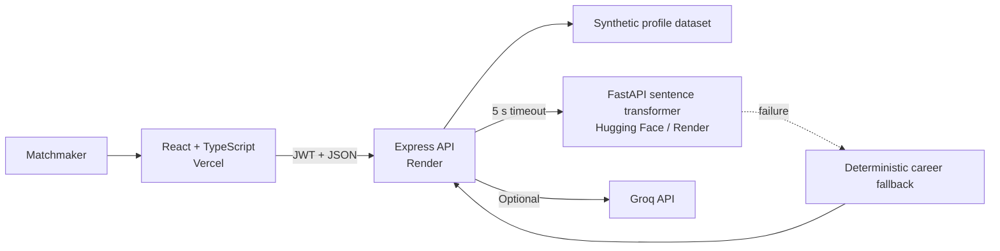

# TDC Matchmaker Portal

An explainable, consent-based matchmaking workflow built as a full-stack portfolio project. A React/TypeScript frontend talks to a secured Node/Express API, which optionally calls a FastAPI sentence-transformer service for career similarity and Groq for opt-in introduction drafts.

> Portfolio status: functional engineering demo. Every profile is synthetic. This is not a production matchmaking service and should not be used for real personal data.

## What it demonstrates

- React 19 and TypeScript frontend with search, pagination, loading/error states, and email-client handoff
- Express 5 API with signed JWT sessions, role checks, Zod validation, rate limiting, Helmet, request-size limits, and restricted CORS
- Explainable compatibility scoring with configurable weights
- FastAPI + `all-MiniLM-L6-v2` career-similarity microservice
- Time-bounded ML calls with an observable deterministic fallback
- Optional Groq/Llama introduction drafting with a transparent template fallback
- 14 automated tests covering scoring, filtering, validation, and service failures

## Architecture



The final score combines career similarity, lifestyle preferences, location, and shared language. Religion, caste, income, age stereotypes, and inferred gender rules do not affect scoring. Gender is only an explicit, optional candidate-pool preference selected by the operator.

## Run locally

Prerequisites: Node.js 20+, npm, and optionally Python 3.11+ for the ML service.

```bash
cd server
cp .env.example .env
npm ci
npm start
```

In another terminal:

```bash
cd client
cp .env.example .env
npm ci
npm run dev
```

The development-only login is `admin` / `admin`. Production refuses to start without a JWT secret and an admin password or bcrypt hash.

To run the optional similarity service:

```bash
cd server
python -m venv .venv
.venv/Scripts/pip install -r requirements.txt  # Windows
.venv/Scripts/python nlp_server.py
```

## Quality checks

```bash
cd server && npm test && npm audit --omit=dev
cd ../client && npm run typecheck && npm run build
```

## Documentation

- [Development guide](docs/DEVELOPMENT.md)
- [API reference](docs/API.md)
- [Architecture and scoring](docs/ARCHITECTURE.md)
- [Deployment runbook](docs/DEPLOYMENT.md)
- [Security, privacy, and limitations](docs/SECURITY.md)

## Current limitations

- Profiles live in a versioned JSON demo dataset, not a database.
- The one configured operator account is suitable only for a portfolio demo; production needs an identity provider, account lifecycle, and audit log.
- The ML service can cold-start on free hosting. The API falls back safely and reports which engine produced the score.
- AI-generated text is a draft. A person must review it and obtain both parties' consent before an introduction.
- No real messages are sent: **Open in email client** creates a local `mailto:` draft.

## License

No license has been granted yet. Treat the repository as source-available for review until a license is added.
